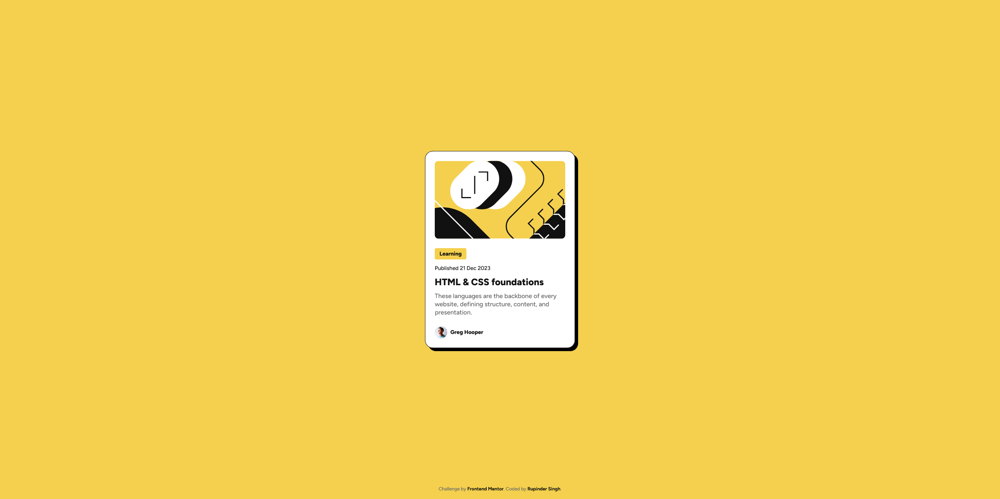

# Frontend Mentor - Blog preview card solution

This is a solution to the [Blog preview card challenge on Frontend Mentor](https://www.frontendmentor.io/challenges/blog-preview-card-ckPaj01IcS). Frontend Mentor challenges help you improve your coding skills by building realistic projects. 

## Table of contents

- [Frontend Mentor - Blog preview card solution](#frontend-mentor---blog-preview-card-solution)
  - [Table of contents](#table-of-contents)
  - [Overview](#overview)
    - [The challenge](#the-challenge)
    - [Screenshot](#screenshot)
    - [Links](#links)
  - [My process](#my-process)
    - [Built with](#built-with)
    - [What I learned](#what-i-learned)
    - [Useful resources](#useful-resources)
  - [Author](#author)

## Overview

### The challenge

Users should be able to:

- See hover and focus states for all interactive elements on the page

### Screenshot



### Links

- Solution URL: [Frontend Mentor](https://www.frontendmentor.io/solutions/blog-preview-card--iH1BoAxSp)
- Live Site URL: [GitHub Pages](https://pellia.github.io/fm-blog-preview-card/)

## My process

### Built with

- Semantic HTML
- CSS | Grid | Flex | Custom Properties
- Mobile-first workflow
- Responsive Design

### What I learned

I explored variable fonts and learned how to implement them, instead of relying on multiple static font variations.

```css
@font-face {
  font-family: "Figtree";
  src: url("../assets/fonts/Figtree-VariableFont_wght.ttf") format("truetype");
  font-display: swap;
  font-style: normal;
  font-weight: 100 1000;
}
```

### Useful resources

- [CSS-Tricks: How to use variable fonts](https://css-tricks.com/newsletter/259-how-to-use-variable-fonts/) - This little newsletter post really helped me wrap my head around variable fonts, something I’d never worked with before.

## Author

- Website - [Rupinder Singh](https://www.rupinder-singh.com/)
- Frontend Mentor - [@Pellia](https://www.frontendmentor.io/profile/Pellia)
